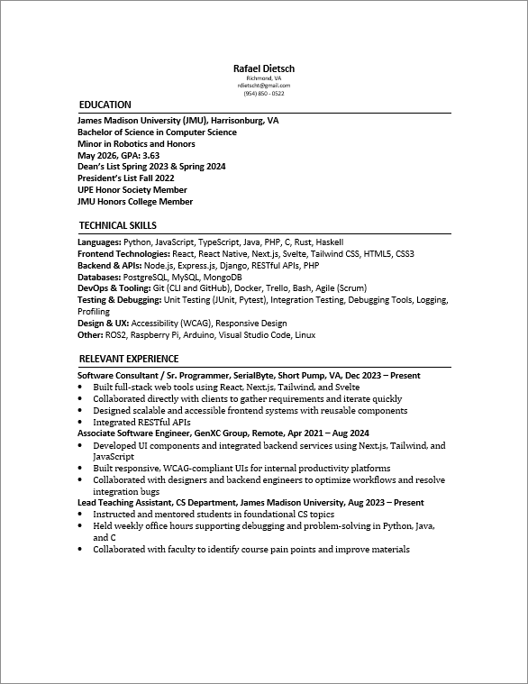

# RAD-Resume-Retrofitter
## A simple resume-building utility

This utility is empowered with `python-docx` and is used primarily to construct custom word documents off formatted document information.

## Usage

To use this utility, simply run the main script as a python3 script:

```
python3 rrr-converter.py
```

Interacting with the script will allow you to customize and set options for your resume, as needed.

## Resume Scanner

This utility works by scanning resume content from a very particular style of text document (`txt`). In order for your resume to be successfully scanned, the document used to gather the information written to the resume must match this format as closely as possible. Below are the guidelines for following the format:

* A resume is split into "sections" with each section containing a section header and section content.
* A section's content may be divided into "sub-sections" that denote a grouping of items related to the overhead section topic. A sub-section may also be used more generally to render a larger bulleted point.
* Section content may be either a text description (i.e., a paragraph), a bulleted list, or a newline.
* Newlines are treated as they are. Only when a newline is encountered will the word document introduce a line-break. **The only exception to this rule are bullet points (*) from a bulleted list and sections/sub-sections (#/$), which will _automatically_ be prepended by a line-break when rendered in the Word document.**
* Each section header begins with a pound (#), with its title text immediately following and should be isolated on its own line.
* A section ends when an empty line is encountered.
* Each sub-section header within a section is surrounded by dollar sign ($).
* Bulleted lists are surrounded by backticks (`) where each bullet point is delimited by an asterisk (*). All bullet list items indicated by an asterisk are surrounded by a single pair of backticks.
* A full description paragraph is surrounded by triple double-quotes (""").

> Any personal info to be listed on the resume does NOT need to be described within the scanned resume document. The `rrr-converter.py` utility will automatically add this near the top of the resume after you have specified any personal contact details during settings configuration.

## Example Usage
An example of a legitimate scanned resume template is shown below:

```plaintext
#EDUCATION
$James Madison University (JMU), Harrisonburg, VA$
$Bachelor of Science in Computer Science$
$Minor in Robotics and Honors$
$May 2026, GPA: 3.63$
$Dean’s List Spring 2023 & Spring 2024$
$President’s List Fall 2022$
$UPE Honor Society Member$
$JMU Honors College Member$

#TECHNICAL SKILLS
$Languages: $"""Python, JavaScript, TypeScript, Java, PHP, C, Rust, Haskell"""
$Frontend Technologies: $"""React, React Native, Next.js, Svelte, Tailwind CSS, HTML5, CSS3"""
$Backend & APIs: $"""Node.js, Express.js, Django, RESTful APIs, PHP"""
$Databases: $"""PostgreSQL, MySQL, MongoDB"""
$DevOps & Tooling: $"""Git (CLI and GitHub), Docker, Trello, Bash, Agile (Scrum)"""
$Testing & Debugging: $"""Unit Testing (JUnit, Pytest), Integration Testing, Debugging Tools, Logging, Profiling"""
$Design & UX: $"""Accessibility (WCAG), Responsive Design"""
$Other: $"""ROS2, Raspberry Pi, Arduino, Visual Studio Code, Linux"""

#RELEVANT EXPERIENCE
$Software Consultant / Sr. Programmer, SerialByte, Short Pump, VA, Dec 2023 – Present$`*Built full-stack web tools using React, Next.js, Tailwind, and Svelte*Collaborated directly with clients to gather requirements and iterate quickly*Designed scalable and accessible frontend systems with reusable components*Integrated RESTful APIs*Managed sprint tracking using Trello and team GitHub repos`
$Associate Software Engineer, GenXC Group, Remote, Apr 2021 – Aug 2024$`*Developed UI components and integrated backend services using Next.js, Tailwind, and JavaScript*Built responsive, WCAG-compliant UIs for internal productivity platforms*Collaborated with designers and backend engineers to optimize workflows and resolve integration bugs*Wrote unit and integration tests to support scalable deployment`
$Lead Teaching Assistant, CS Department, James Madison University, Aug 2023 – Present$`*Instructed and mentored students in foundational CS topics*Held weekly office hours supporting debugging and problem-solving in Python, Java, and C*Collaborated with faculty to identify course pain points and improve materials*Trained new TAs and contributed to inclusive classroom culture`
```
The template above produces the following `.docx` file displayed below. Note that this document contains personal information that were specified **via the TUI displayed when running the Python utility**:

